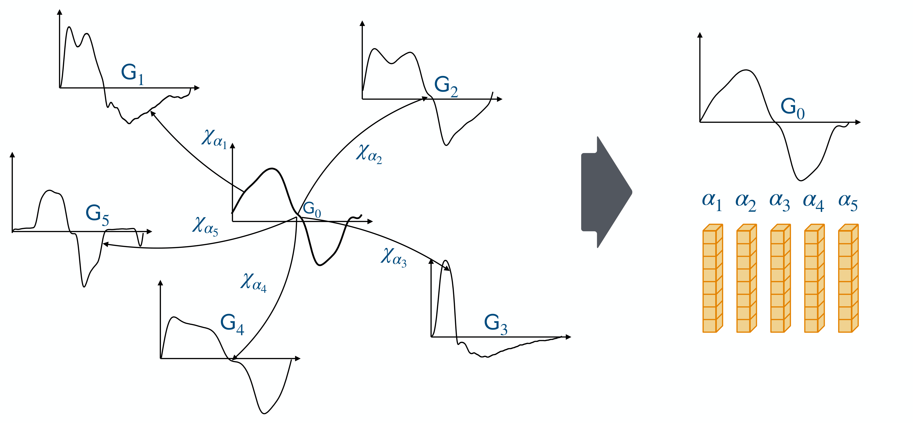
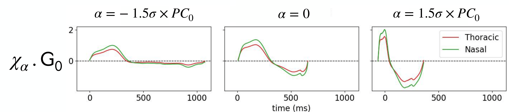

.. PCA_for_time_series documentation master file, created by
   sphinx-quickstart on Wed Dec 10 11:43:18 2025.
   You can adapt this file completely to your liking, but it should at least
   contain the root `toctree` directive. Page d'accueil , voir model gaethan

TS-PCA
======

PCA for time series documentation
=================================

.. Add your content using ``reStructuredText`` syntax. See the
.. `reStructuredText <https://www.sphinx-doc.org/en/master/usage/restructuredtext/index.html>`_
.. documentation for details.

Authors
-------

Samuel Gruffaz, Thibaut Germain

Overview
--------

This repository gathers the functions developed in the paper  
**"Shape Analysis for Time Series"**  
https://proceedings.neurips.cc/paper_files/paper/2024/file/ad86418f7bdfa685cd089e028efd75cd-Paper-Conference.pdf

It is possible to represent **irregularly sampled time series of different lengths** 
and to apply **kernel PCA** to these representations in order to identify 
the main modes of shape variation in the time series.

   Time series graphs :math:`(\mathsf{G}_i)_{i\in[5]}` are represented as the 
   deformations of a reference time series graph :math:`\mathsf{G}_0` by 
   transformations :math:`(\chi_{\alpha_i})_{i\in[5]}` parameterized by 
   :math:`(\alpha_i)_{i\in[5]}`.

These methods work particularly well when the analyzed dataset is 
**homogeneous in terms of shapes**, for example when each time series corresponds to:

- a heartbeat recording,
- a respiratory cycle,
- an electricity consumption pattern,
- a heating load curve.

Dataset Format
==============

The main requirement is to represent the time series dataset as a collection 
of **time series graphs**.

Each time series graph should be an array ``T`` of shape ``(n_samples, d+1)``, where:

- ``T[:, 0]`` contains the time points,
- ``T[:, 1:]`` contains the time series values of dimension ``d``.

The full dataset should be an array of fixed shape  
``(n_time_series, n_samples_max, d+1)``  
along with a corresponding mask of shape  
``(n_time_series, n_samples_max, 1)``.

Here, ``n_samples_max`` is the maximum number of samples among all time series.  
This accommodates the fact that each time series may have a different number of samples.

Default parameters work well when the distance between two consecutive time points 
is approximately 1.

TS-PCA: Basic Usage Example
===========================

This example demonstrates the basic workflow of using the ``TS-PCA`` package 
to analyze time-series data using TS-LDDMM representations and Kernel PCA.

.. code-block:: python

   # Import or generate a toy dataset
   N = 8
   dataset, dataset_mask, graph_ref, graph_ref_mask = generate_easy_dataset(N=N)

   # dataset is an array of shape (8, 200, 2)
   # dataset_mask is an array of shape (8, 200, 1)

   # Initialize the TS-PCA class
   class_test = TS_PCA_()

   # Step 1: Fit TS-LDDMM representations
   # This learns the temporal-shape embeddings of the dataset.
   # Set learning_graph_ref=True to learn the reference graph;
   # here we keep it fixed.
   class_test.fit_TS_LDDMM_representations(
       dataset,
       dataset_mask,
       learning_graph_ref=False,
       graph_ref=graph_ref,
       graph_ref_mask=graph_ref_mask
   )

   # Step 2: Fit Kernel PCA on the learned representations
   class_test.fit_kernel_PCA()

   # Step 3: Visualize the principal components
   class_test.plot_components()

   After applying Kernel PCA to the TS-LDDMM features 
   :math:`(\alpha_j)_{j \in [N]}` extracted from a dataset of mouse respiratory cycles 
   under drug exposure, we visualize the deformations 
   :math:`\chi_\alpha \cdot \mathsf{G}_0` of the reference time series graph 
   :math:`\mathsf{G}_0` as :math:`\alpha` varies along the principal component 
   :math:`PC_0`. Notably, :math:`\alpha = -1.5 \sigma \times PC_0` captures the deformation 
   accounting for the effect of the drug on the respiratory cycle.

Project Structure
=================
The TS_PCA_ class provides a high-level interface that wraps all the main functionalities of the package, while the kernel, lddmm, loss, and utils modules implement the core underlying methods.

.. toctree::
   :maxdepth: 1

   source/class/TS_PCA_class

   source/not_class/kernel

   source/not_class/lddmm

   source/not_class/loss

   source/not_class/utils

